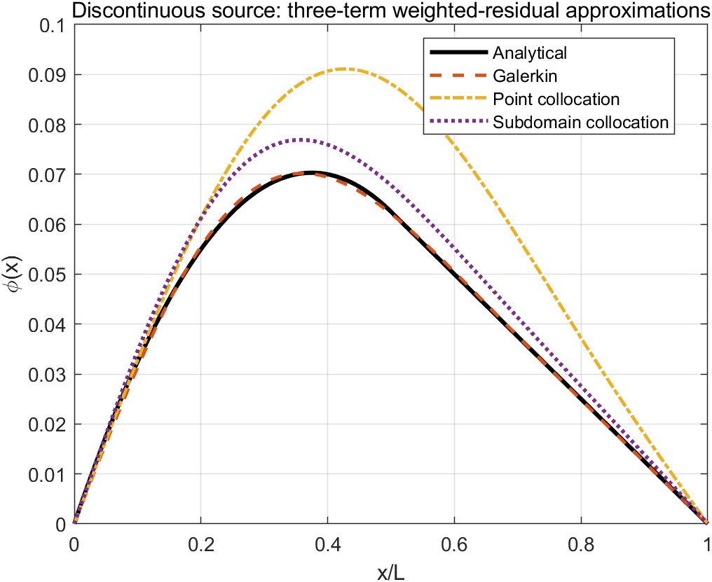
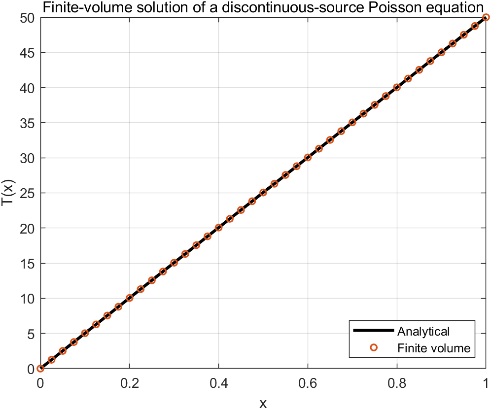

# 1D Poisson Equations: Weighted Residuals and Finite Volumes

This project compares global weighted-residual approximations with a locally conservative finite-volume discretization for one-dimensional Poisson equations. It illustrates how the choice of trial space and residual enforcement changes the approximation, and how a mesh-based method converges to a piecewise analytical solution.

## Problem A: discontinuous source

The first boundary-value problem is

\[
\frac{d^2\phi}{dx^2}+S(x)=0,\qquad \phi(0)=\phi(L)=0,
\]

with

\[
S(x)=\begin{cases}
1, & 0\leq x\leq L/2,\\
0, & L/2<x\leq L.
\end{cases}
\]

A three-term sine basis is used to construct Galerkin, point-collocation, and subdomain-collocation approximations. The three approximations are evaluated against the continuous piecewise analytical solution.

## Problem B: quadratic source

The second problem is

\[
\frac{d^2\phi}{dx^2}+10x^2=0,\qquad \phi(0)=0,\quad \phi(1)=1.
\]

Two-term Galerkin, point-collocation, and subdomain-collocation approximations are compared with

\[
\phi(x)=-\frac{5}{6}x^4+\frac{11}{6}x.
\]

## Finite-volume verification

The discontinuous-source equation is also solved with a uniform node-centered finite-volume discretization using Dirichlet conditions

\[
T(0)=0,\qquad T(1)=50.
\]

For a uniform grid the interior balance reduces to

\[
T_{i-1}-2T_i+T_{i+1}=-S_i\Delta x^2.
\]

The implementation reports RMS and maximum absolute errors against the corresponding piecewise analytical solution.
Because the source discontinuity passes through the center of one control
volume, that volume uses the exact cell-average source, `S=0.5`, rather than
assigning the point value from either side. This preserves the integral
balance represented by the finite-volume method.

## Files

- `weighted_residual_step_source.m`: three-term approximations for a discontinuous source.
- `weighted_residual_quadratic_source.m`: two-term approximations for a quadratic source.
- `finite_volume_step_source.m`: finite-volume solution and analytical verification.
- `run_all.m`: reproduces every figure and writes `results/error_summary.csv`.

## Reproduce the results

From MATLAB:

```matlab
cd('01-1d-poisson-weighted-residual-fvm')
run_all
```

From a terminal with MATLAB on `PATH`:

```text
matlab -batch "cd('path/to/01-1d-poisson-weighted-residual-fvm'); run_all"
```

Generated files are placed in `results/`.

## Results

| Problem | Method | RMS error | Maximum absolute error |
|---|---:|---:|---:|
| Discontinuous source | Galerkin | 5.870e-4 | 1.404e-3 |
| Discontinuous source | Point collocation | 1.599e-2 | 2.672e-2 |
| Discontinuous source | Subdomain collocation | 4.595e-3 | 7.496e-3 |
| Quadratic source | Galerkin | 1.821e-2 | 3.748e-2 |
| Quadratic source | Point collocation | 5.055e-2 | 8.834e-2 |
| Quadratic source | Subdomain collocation | 1.062e-1 | 1.731e-1 |
| Discontinuous source with nonzero boundary | Finite volume | 1.057e-13 | 1.634e-13 |

For the discontinuous-source examples, the Galerkin approximation gives the
smallest error among the three weighted-residual formulations. The
finite-volume result agrees to roundoff because the mesh is aligned with the
source discontinuity, the discontinuous cell uses the exact volume-averaged
source, and the analytical solution is piecewise quadratic/linear - exactly
the form represented by the second-order cell balance in each region.





## Numerical checks

The automated run checks that:

- all reported errors are finite;
- the finite-volume RMS error is below `1e-10` on the default 41-node grid;
- every expected figure and the CSV summary are produced.
