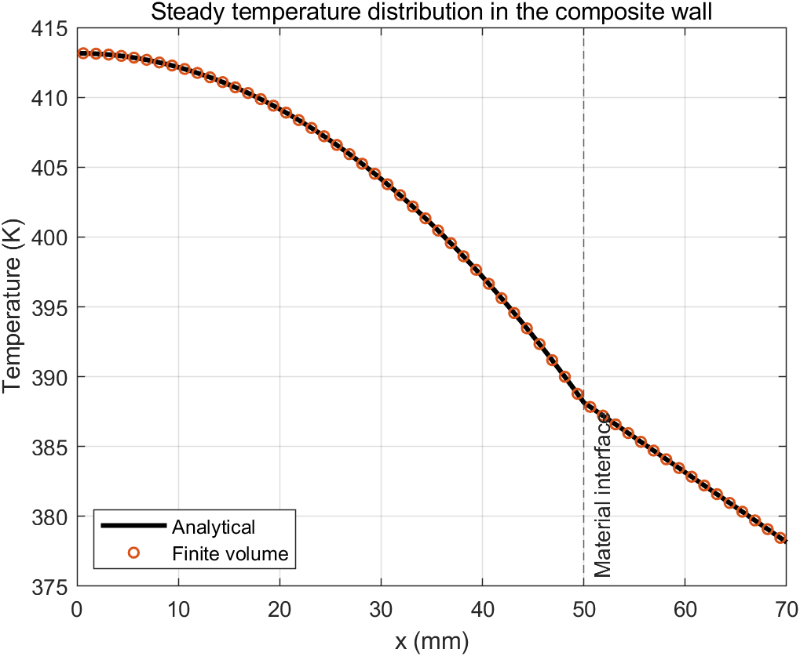
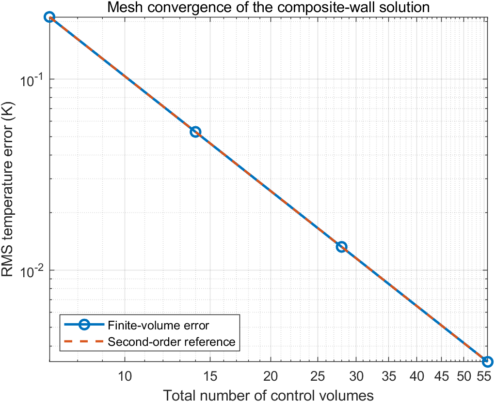
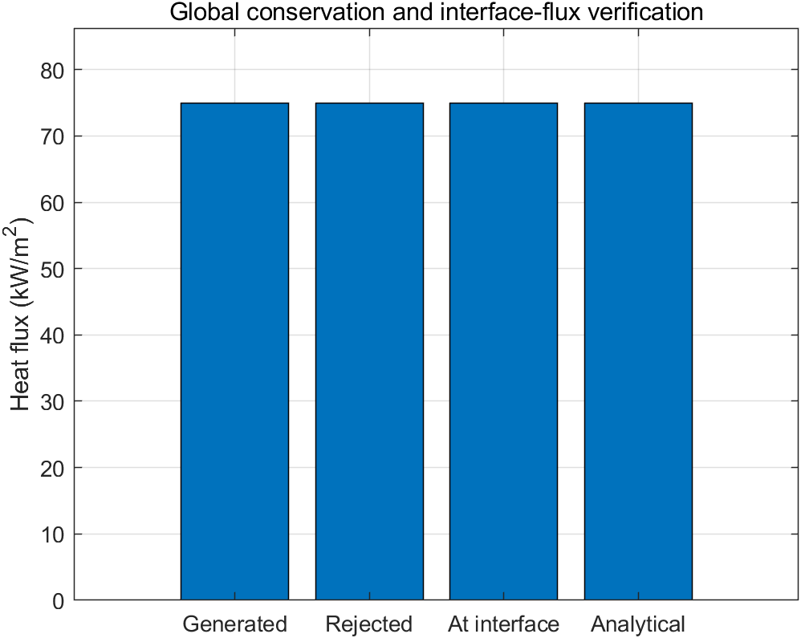

# Finite-Volume Heat Conduction in a Composite Wall

This project solves steady one-dimensional heat conduction through a
two-material wall. Material A generates heat internally, the left surface is
insulated, and the right surface rejects heat by convection. The example is
small enough to admit an analytical solution, making it useful for verifying
material-interface treatment and a tridiagonal finite-volume solver.

## Physical model

| Quantity | Material A | Material B |
|---|---:|---:|
| Thickness | 0.05 m | 0.02 m |
| Thermal conductivity | 75 W/(m K) | 150 W/(m K) |
| Volumetric heat generation | 1.5e6 W/m^3 | 0 W/m^3 |

The right boundary has `h = 1000 W/(m^2 K)` and `T_inf = 303.15 K`. The
governing equation in each material is

\[
\frac{d}{dx}\left(k\frac{dT}{dx}\right)+\dot q=0.
\]

The boundary and interface conditions are

\[
\left.\frac{dT}{dx}\right|_{x=0}=0,
\qquad
-k\left.\frac{dT}{dx}\right|_{x=L}=h[T(L)-T_\infty],
\]

with continuous temperature and heat flux at the material interface.

## Numerical method

The wall is divided into cell-centered control volumes with a face aligned to
the material interface. The conductance between adjacent cell centers is
computed from the two half-cell thermal resistances:

\[
G_f=\left(\frac{\Delta x_P}{2k_P}+
          \frac{\Delta x_E}{2k_E}\right)^{-1}.
\]

This resistance form reduces to the harmonic-mean conductivity on a uniform
mesh and enforces the correct interface heat flux. The convection boundary is
treated by combining the last half-cell conduction resistance with `1/h`.
The resulting tridiagonal system is solved with the Thomas algorithm (TDMA).

## Analytical solution

All generated heat must leave through the right surface, so the heat flux is

\[
q''=\dot q_A L_A=75{,}000\ \mathrm{W/m^2}.
\]

For the specified properties, the analytical temperature is

\[
T_A(x)=413.15-10{,}000x^2\ \mathrm{K},
\qquad
T_B(x)=413.15-500x\ \mathrm{K}.
\]

The interface and exposed-surface temperatures are 388.15 K and 378.15 K,
respectively.

## Files

- `solve_composite_wall.m`: grid generation, coefficient assembly, TDMA call,
  analytical solution, and conservation diagnostics.
- `tdma_solver.m`: reusable Thomas-algorithm implementation.
- `run_all.m`: mesh verification, figures, CSV output, and assertions.

## Reproduce the results

From MATLAB:

```matlab
cd('02-composite-wall-conduction')
run_all
```

The run generates `results/mesh_verification.csv`,
`results/conservation_summary.csv`, and the figures shown below.

## Verification criteria

- TDMA and MATLAB's direct linear solver must agree within `1e-10 K`.
- Successive mesh refinements must demonstrate approximately second-order
  convergence against the analytical solution.
- The finest tested mesh must have a maximum temperature error below `0.005 K`.
- The global heat-generation/rejection imbalance must be below `1e-10`.
- Interface heat flux must agree with the analytical value within `1e-10`.

The global balance and interface heat flux are conservative to roundoff. The
temperature field converges at second order. A small truncation error remains
next to the material interface because heat generation makes the heat flux
vary within the half cell on the material-A side, whereas the standard
two-point interface conductance assumes a face flux across that half-cell
resistance.

## Results

| Cells (A + B) | RMS error (K) | Maximum error (K) | Observed order |
|---:|---:|---:|---:|
| 5 + 2 | 2.113e-1 | 2.500e-1 | - |
| 10 + 4 | 5.282e-2 | 6.250e-2 | 2.000 |
| 20 + 8 | 1.321e-2 | 1.562e-2 | 2.000 |
| 40 + 16 | 3.301e-3 | 3.906e-3 | 2.000 |

For the finest mesh, generated heat, rejected heat, interface heat flux, and
the analytical heat flux are all `75,000 W/m^2` to displayed precision.






