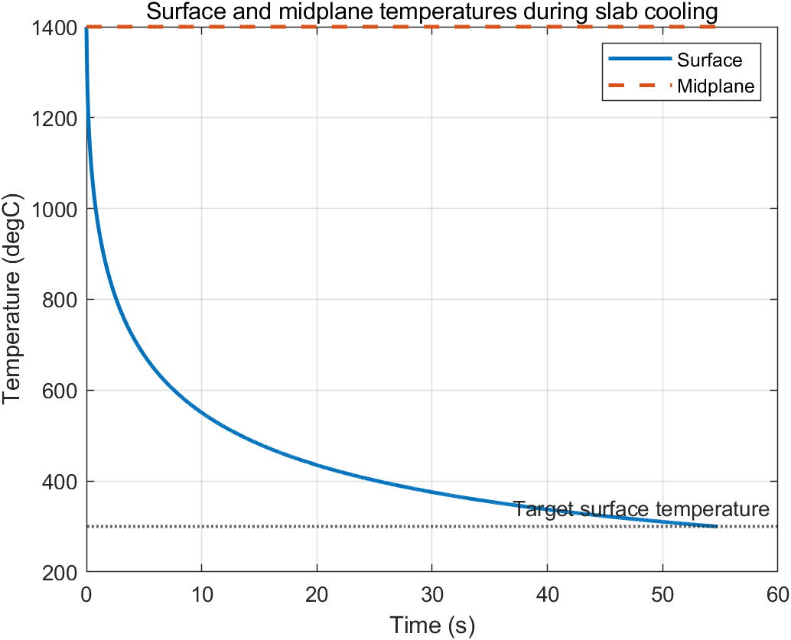
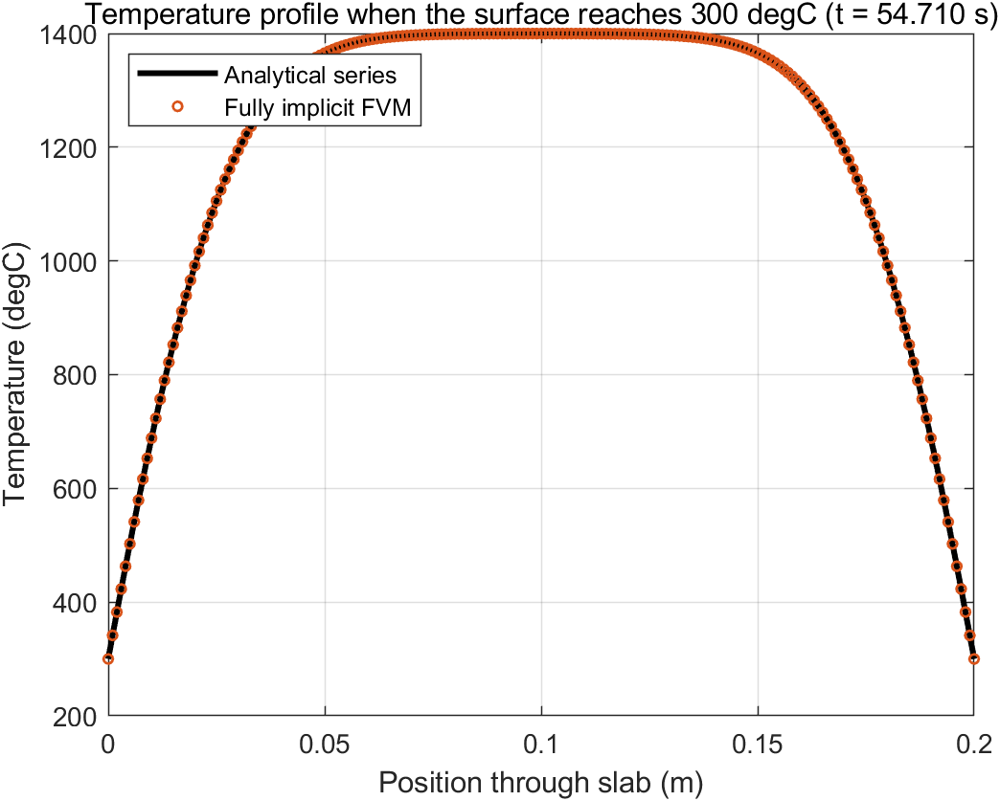
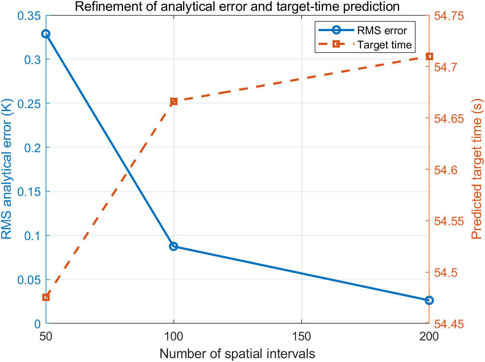

# Implicit Finite-Volume Simulation of Convective Slab Cooling

This project predicts how long a hot plane wall takes to cool to a specified
surface temperature. It uses a fully implicit finite-volume method and
compares the transient temperature field with the analytical eigenfunction
solution for a plane wall with convection at both surfaces.

## Physical model

| Quantity | Value |
|---|---:|
| Slab thickness | 0.2 m |
| Initial temperature | 1400 degC |
| Ambient temperature | 50 degC |
| Target surface temperature | 300 degC |
| Convection coefficient | 5000 W/(m^2 K) |
| Thermal conductivity | 30 W/(m K) |
| Density | 7800 kg/m^3 |
| Specific heat | 700 J/(kg K) |

The governing equation is

\[
\rho c_p\frac{\partial T}{\partial t}
=k\frac{\partial^2T}{\partial x^2},
\]

with convection at `x=0` and `x=L`:

\[
-k\frac{\partial T}{\partial n}=h(T-T_\infty).
\]

## Numerical method

The grid uses boundary nodes with half control volumes and uniformly spaced
interior nodes. Backward Euler time integration gives

\[
\frac{\rho c_p\Delta x_i}{\Delta t}(T_i^{n+1}-T_i^n)
=G_w(T_W^{n+1}-T_i^{n+1})
+G_e(T_E^{n+1}-T_i^{n+1}).
\]

The convection terms are included directly in the two boundary control-volume
balances. The resulting tridiagonal system is solved with TDMA at every time
step. Linear event interpolation estimates the time and temperature profile
at the instant the surface reaches 300 degC.

## Analytical verification

For a symmetric plane wall of half-thickness `L_c`, the dimensionless
temperature is

\[
\frac{\theta}{\theta_i}=\sum_{n=1}^{\infty} C_n
\cos\left(\zeta_n\frac{x_c}{L_c}\right)
\exp(-\zeta_n^2 Fo),
\]

where `zeta_n tan(zeta_n) = Bi`,
`Bi = h L_c/k`, and

\[
C_n=\frac{4\sin\zeta_n}{2\zeta_n+\sin(2\zeta_n)}.
\]

The analytical series is evaluated at the numerically predicted target time.

## Files

- `solve_slab_cooling.m`: fully implicit finite-volume time integrator.
- `analytical_slab_temperature.m`: analytical plane-wall series solution.
- `tdma_solver.m`: reusable Thomas-algorithm implementation.
- `run_all.m`: refinement study, figures, CSV files, and assertions.

## Reproduce the results

```matlab
cd('03-transient-slab-cooling')
run_all
```

Generated results are written to `results/`.

## Verification checks

- the left and right halves remain symmetric;
- the discrete energy decrease equals convection loss at every full step;
- TDMA agrees with MATLAB's direct linear solution;
- refinement reduces disagreement with the analytical temperature field;
- the interpolated final surface temperature equals the 300 degC target.

## Results

| Spatial intervals | Time step (s) | Predicted target time (s) | RMS analytical error (K) | Maximum error (K) |
|---:|---:|---:|---:|---:|
| 50 | 0.04 | 54.475 | 0.3288 | 0.5963 |
| 100 | 0.02 | 54.666 | 0.0875 | 0.1568 |
| 200 | 0.01 | 54.710 | 0.0263 | 0.0431 |

The finest calculation predicts that the surfaces reach 300 degC after
approximately `54.710 s`. At that instant the midplane remains near
`1399.9 degC`; the short cooling time and large Biot number produce steep
thermal gradients confined near the two surfaces. The solution remains
symmetric to approximately `8e-12 K`, and the maximum normalized discrete
energy-balance residual is below `4e-11`.






