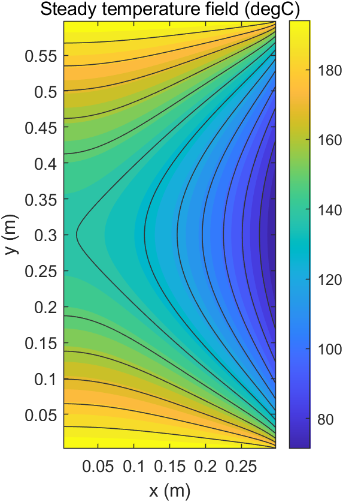
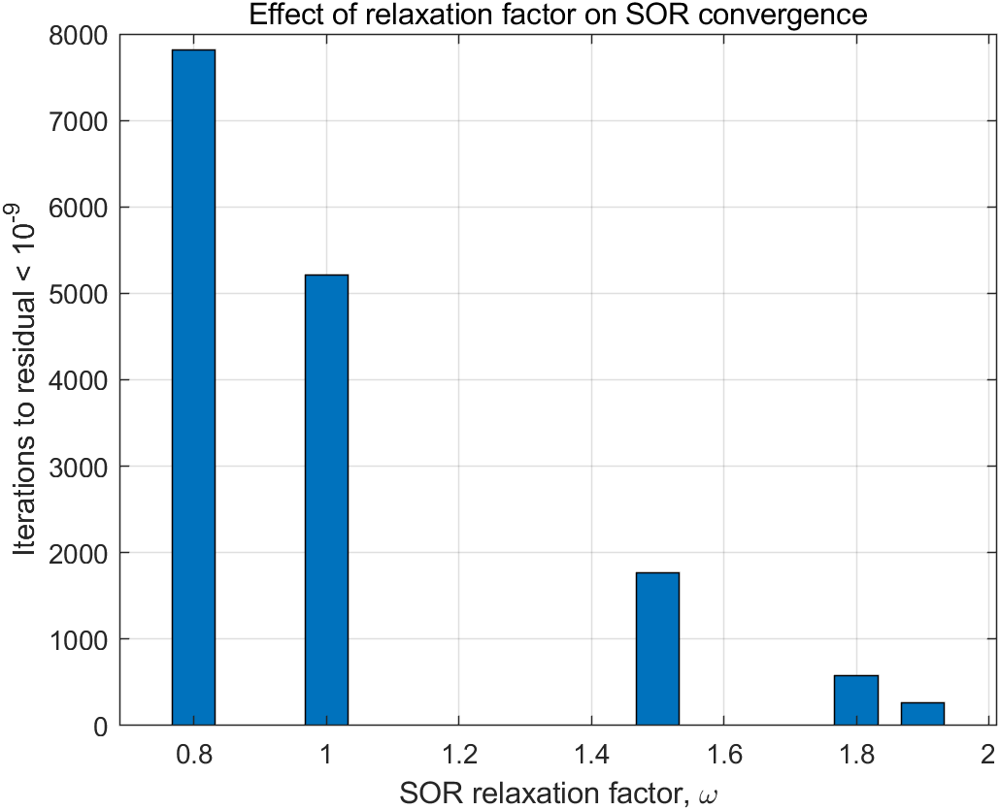
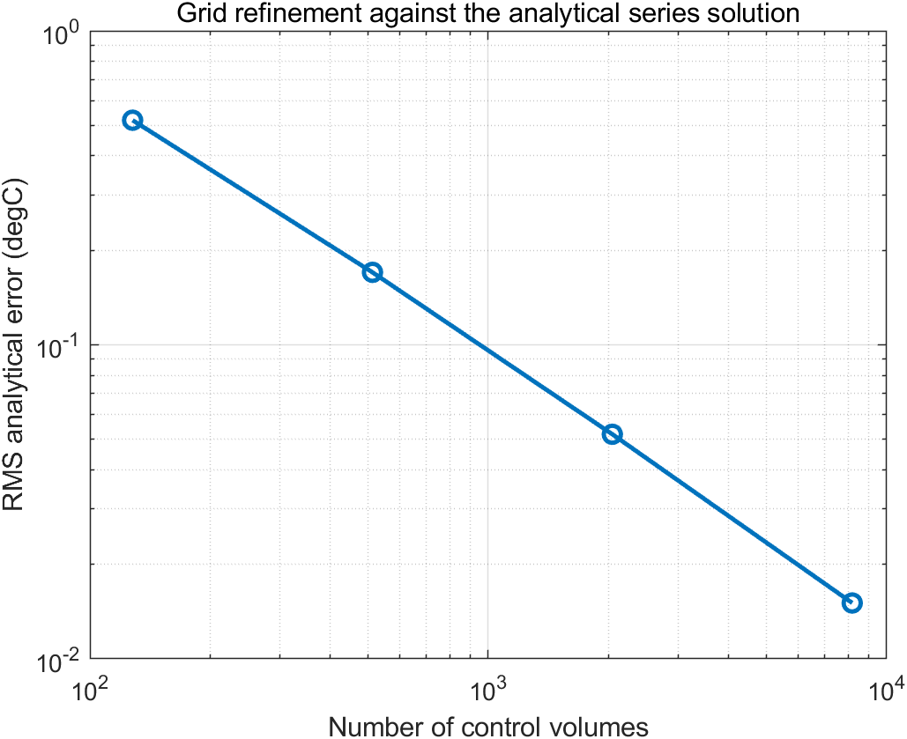

# SOR Solution of 2D Steady Heat Conduction with Mixed Boundary Conditions

This project solves the two-dimensional Laplace equation in a rectangular
solid using a cell-centered finite-volume method and successive
over-relaxation (SOR). It demonstrates how relaxation affects convergence
speed without changing the converged physical solution.

## Physical model

The rectangular domain has width `L_x = 0.3 m`, height `L_y = 0.6 m`, and
thermal conductivity `k = 2 W/(m K)`. The governing equation is

\[
\nabla\cdot(k\nabla T)=0.
\]

Boundary conditions are:

- top and bottom: `T = 200 degC`;
- left: insulated, `dT/dx = 0`;
- right: convection with `h = 20 W/(m^2 K)` and `T_inf = 25 degC`.

All heat rates are reported per unit depth in the out-of-plane direction.

## Numerical method

The diffusion equation is integrated over cell-centered control volumes.
Interior face conductances are `k A/d`. Dirichlet boundaries use the distance
from the cell center to the boundary face, and the convective boundary uses a
series combination of half-cell conduction and external convection:

\[
G_{right}=\frac{A}{\Delta x/(2k)+1/h}.
\]

The resulting equation for each control volume is updated with point SOR:

\[
T_P^{new}=(1-\omega)T_P^{old}
+\frac{\omega}{a_P}\left(\sum a_{nb}T_{nb}+b\right).
\]

## Independent verification

Three checks are performed:

1. SOR is compared with MATLAB's sparse direct solution of the same matrix.
2. The finite-volume field is compared with a separation-of-variables series
   satisfying the insulated, isothermal, and convective boundaries.
3. Heat entering through the isothermal top and bottom boundaries is compared
   with heat leaving through the convective right boundary.

## Files

- `solve_steady_conduction_2d.m`: coefficient assembly, SOR iteration,
  residual evaluation, and conservation diagnostics.
- `analytical_temperature_2d.m`: separation-of-variables reference solution.
- `run_all.m`: relaxation benchmark, grid study, figures, CSV files, and
  automated checks.

## Reproduce the results

```matlab
cd('04-2d-steady-conduction-sor')
run_all
```

Generated files are written to `results/`.

## Results

### Relaxation-factor benchmark (`24 x 48` control volumes)

| Relaxation factor | Iterations to normalized residual below 1e-11 |
|---:|---:|
| 0.8 | 7818 |
| 1.0 | 5209 |
| 1.5 | 1763 |
| 1.8 | 575 |
| 1.9 | 266 |

All relaxation factors converge to a center temperature of approximately
`124.55 degC` and a right-boundary heat-transfer rate of approximately
`834.72 W/m`. Thus, relaxation changes convergence speed but not the
converged physical result. For this grid, `omega = 1.9` reduces the iteration
count by about 95% relative to Gauss-Seidel (`omega = 1`).

### Grid refinement (`omega = 1.9`)

| Grid | RMS analytical error (degC) | Maximum error (degC) |
|---:|---:|---:|
| 8 x 16 | 0.5192 | 3.3945 |
| 16 x 32 | 0.1702 | 2.1270 |
| 32 x 64 | 0.0519 | 1.2119 |
| 64 x 128 | 0.0151 | 0.6490 |

The RMS error decreases consistently under refinement. The largest local
errors occur near the two right-hand corners, where the isothermal top/bottom
conditions meet the convective side condition. This boundary-condition
incompatibility creates steep local gradients and reduces the apparent global
order relative to an entirely smooth solution.

For the finest grid, the relative global heat-balance error is approximately
`5.7e-9`, and SOR differs from MATLAB's sparse direct solution by less than
`7.3e-7 degC`.






