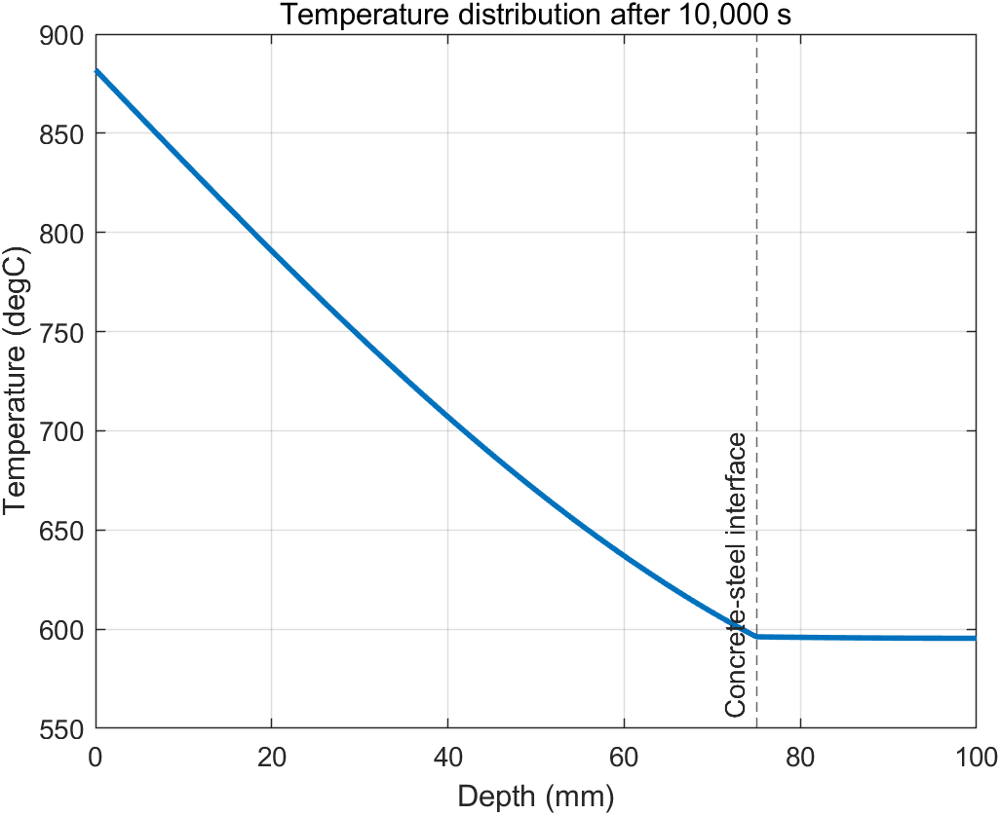
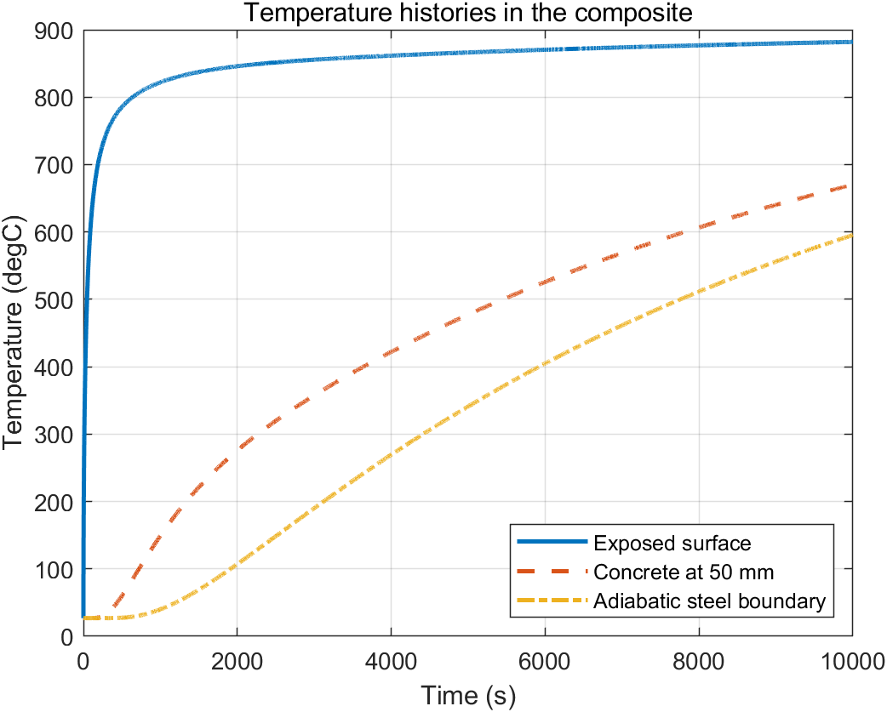
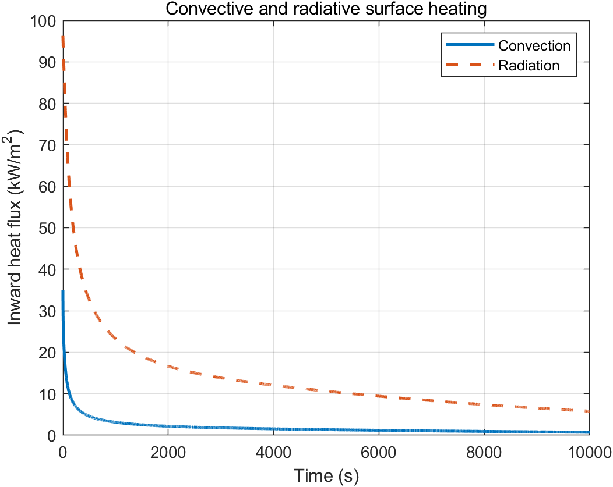
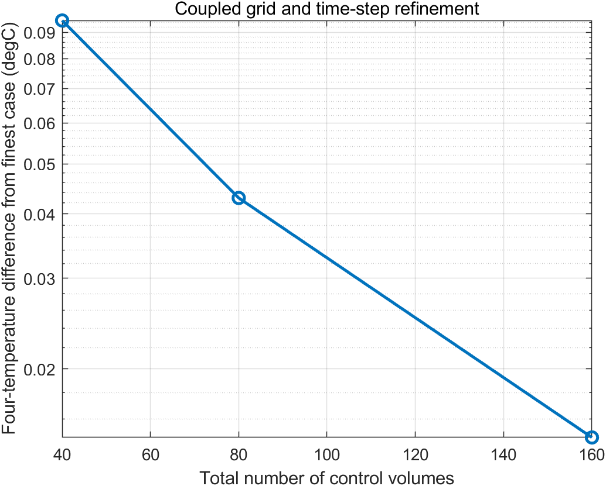

# Transient Heating of a Concrete-Steel Composite with Convection and Radiation

This project models one-dimensional transient heating of a concrete-steel
composite exposed to a high-temperature environment. It focuses on
discontinuous material properties, nonlinear surface radiation, and strict
energy conservation.

## Physical model

The 100 mm domain consists of 75 mm of concrete and 25 mm of steel. The
concrete surface at `x=0` is exposed to convection and radiation from a
`900 degC` environment; the steel boundary at `x=100 mm` is adiabatic. The
initial temperature is `27 degC`, and the simulation time is 10,000 s.

| Property | Concrete | Steel |
|---|---:|---:|
| Thermal conductivity | 1.4 W/(m K) | 55 W/(m K) |
| Density | 2300 kg/m^3 | 7850 kg/m^3 |
| Specific heat | 880 J/(kg K) | 450 J/(kg K) |

Boundary parameters are `h = 40 W/(m^2 K)` and emissivity `epsilon = 0.9`.

## Governing equation

\[
\rho c_p\frac{\partial T}{\partial t}
=\frac{\partial}{\partial x}\left(k\frac{\partial T}{\partial x}\right).
\]

At the exposed surface,

\[
q''_{in}=h(T_\infty-T_s)
+\epsilon\sigma(T_\infty^4-T_s^4).
\]

## Numerical method

- Cell-centered finite volumes place the concrete-steel interface exactly on
  a control-volume face.
- Interface conductance is computed from the two half-cell thermal
  resistances, which is equivalent to harmonic averaging on an equal grid.
- Backward Euler time integration produces a tridiagonal system.
- TDMA solves the system at every nonlinear iteration.
- The radiation term is factored as

\[
T_\infty^4-T_s^4=(T_\infty-T_s)
(T_\infty+T_s)(T_\infty^2+T_s^2),
\]

  giving a temperature-dependent radiative heat-transfer coefficient.
  Picard iteration is continued within each time step until the surface
  temperature and radiation coefficient are mutually consistent.

## Verification

The automated run checks:

- global stored-energy increase against the converged convection+radiation
  input at every time step;
- TDMA against MATLAB's sparse direct solver;
- nonlinear surface-temperature convergence;
- monotonic heating histories;
- decreasing differences under coupled grid and time-step refinement.

## Results

After 10,000 s, the finest calculation (320 control volumes and a 0.5 s time
step) predicts:

| Quantity | Value |
|---|---:|
| Exposed-surface temperature | 882.01 degC |
| Concrete temperature at 50 mm | 669.97 degC |
| Concrete-steel interface temperature | 596.15 degC |
| Adiabatic steel-boundary temperature | 595.41 degC |
| Heat flux through the material interface | 3.267 kW/m^2 |

The concrete layer supports most of the temperature drop because its thermal
conductivity is far lower than that of steel. Consequently, the thin steel
layer is nearly isothermal at the final time. Radiation dominates the early
surface heat input, while both radiative and convective fluxes decrease as the
surface approaches the 900 degC environment.

The four monitored final temperatures change by 0.0948, 0.0429, and 0.0147
degC relative to the finest case as the coupled grid/time-step sequence is
refined. Across all cases, the maximum normalized transient energy-balance
residual is below `5e-11`, and TDMA agrees with MATLAB's direct solver within
`3e-12 K`.

## Files

- `solve_composite_heating.m`: grid, material properties, nonlinear boundary
  iteration, implicit time integration, and diagnostics.
- `tdma_solver.m`: Thomas algorithm for the tridiagonal systems.
- `run_all.m`: refinement study, result tables, figures, and assertions.

## Reproduce the results

```matlab
cd('05-composite-wall-fire-heating')
run_all
```

Generated files are written to `results/`.








