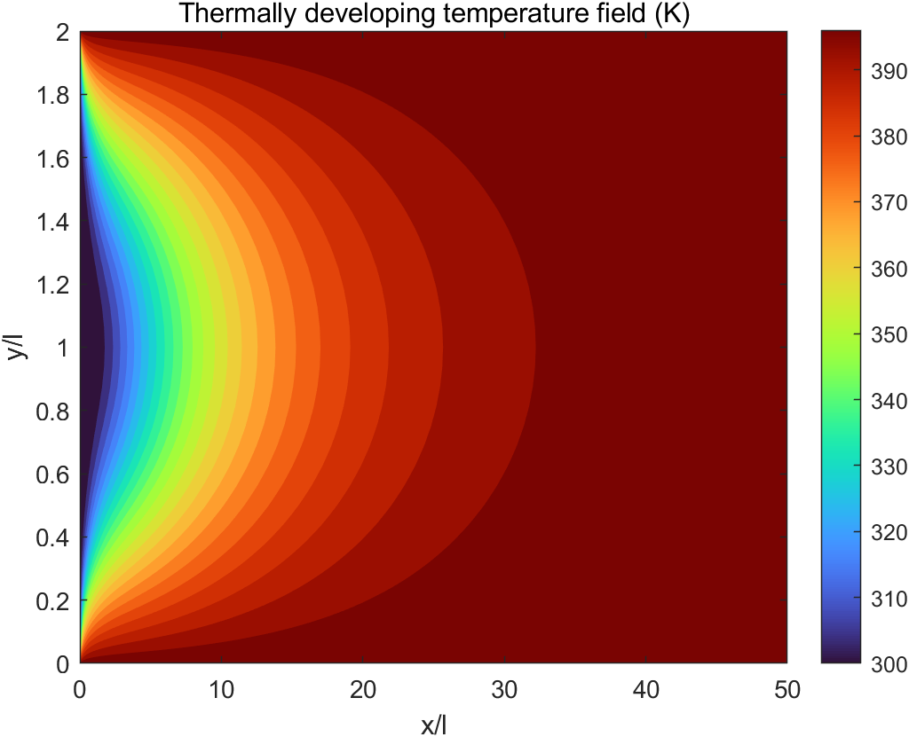
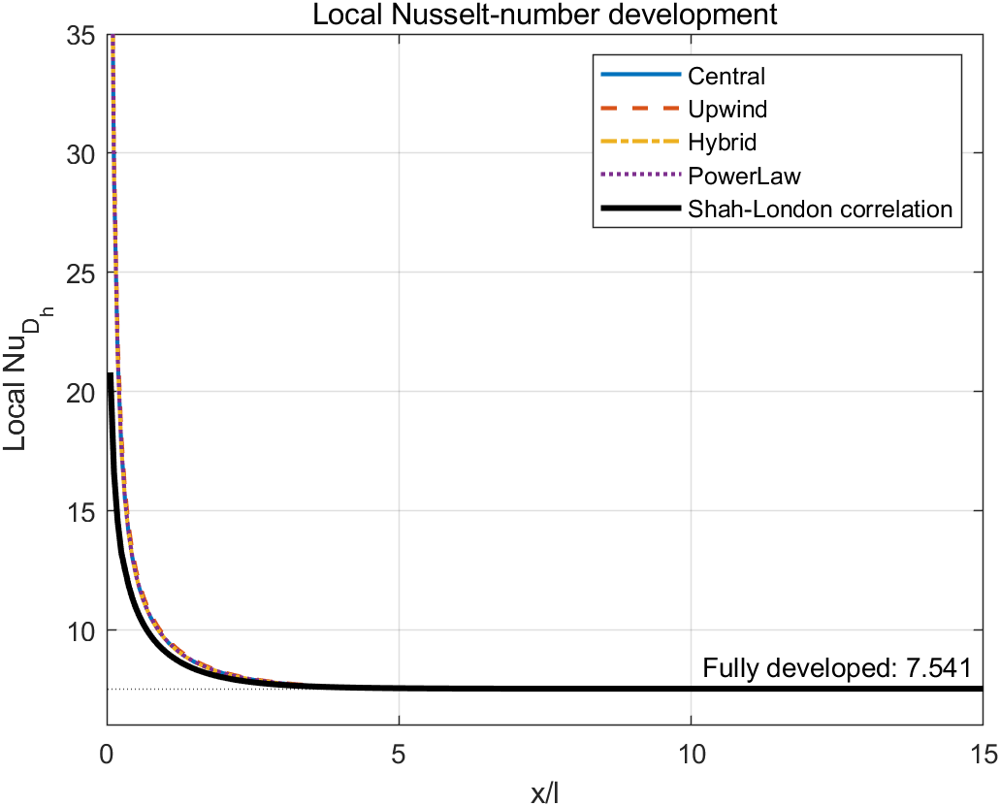
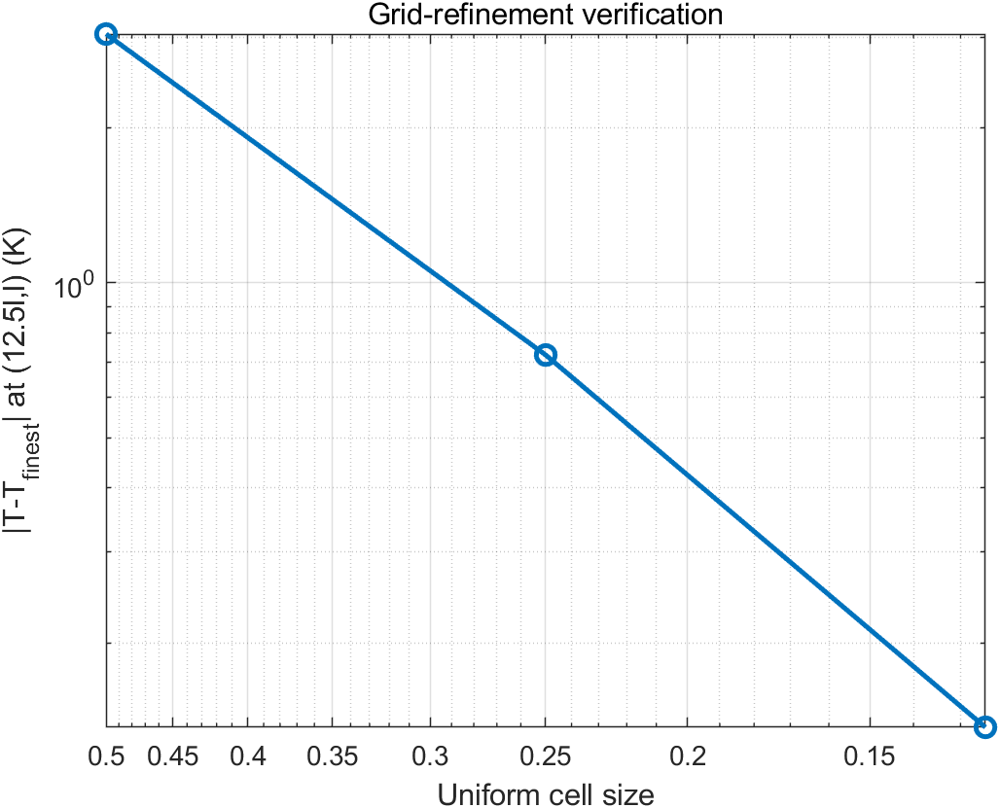
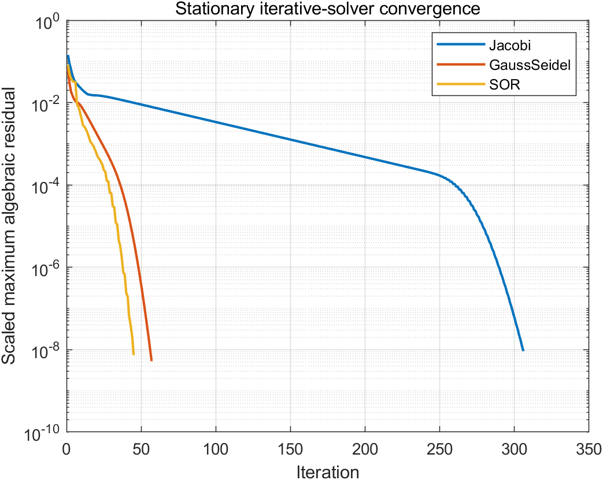

# Thermally Developing Laminar Channel Flow: Scheme and Solver Comparison

This project solves the steady energy equation for hydrodynamically developed
laminar flow between two isothermal parallel plates. It demonstrates how the
convection discretization, linear solver, and grid resolution affect a finite-
volume prediction of the developing temperature field and local Nusselt number.

## Physical model

Air enters a two-dimensional channel at `300 K`. Both plates are held at
`400 K`, the channel half-gap is `l = 1 m`, and its length is `50l`. A fully
developed parabolic velocity profile is prescribed at a Reynolds number of 50
based on the full gap `2l`. This corresponds to `Re_Dh = 100` when the parallel-
plate hydraulic diameter `Dh = 4l` is used.

The steady, constant-property energy equation is

\[
\nabla\cdot(\rho c_p\mathbf{u}T)=\nabla\cdot(k\nabla T).
\]

The inlet temperature and wall temperatures are Dirichlet conditions; a zero
streamwise diffusive flux is imposed at the outlet.

## Numerical method

- A node-centered finite-volume grid resolves both plates and the inlet.
- Central differencing, first-order upwind, hybrid, and power-law convection
  schemes use the standard Peclet-number weighting formulation.
- Sparse direct solutions isolate discretization effects in the scheme and grid
  comparisons.
- Jacobi, Gauss-Seidel, and SOR solve the same algebraic system in the iterative-
  solver benchmark. A short stability check selected `omega = 1.1` for SOR;
  the `omega = 1.6` value used in the course submission is unstable after the
  coefficient corrections described below.
- Convergence is based on the scaled algebraic residual, not only on the change
  between consecutive iterates.
- The bulk temperature is velocity weighted. A second-order one-sided wall
  gradient is used to calculate the local Nusselt number.

## Verification strategy

`run_all.m` automatically checks that:

- the converged field is symmetric about the channel centerline;
- every temperature remains between the inlet and wall values;
- iterative solutions agree with MATLAB's sparse direct solution;
- the monitored temperature approaches the finest-grid result monotonically;
- the downstream Nusselt number approaches the constant-wall-temperature
  parallel-plate limit, `Nu_Dh = 7.541`.

The numerical local Nusselt number is also compared with the piecewise
Shah-London correlation summarized by Nickolay and Martin (2002),
doi:[10.1016/S0017-9310(02)00028-5](https://doi.org/10.1016/S0017-9310(02)00028-5).

## Results

The `0.0625l` reporting grid contains 26,433 temperature unknowns. With the
power-law scheme, the local Nusselt number enters the 1% band around its
fully-developed value at `x/l = 4.06` and reaches `Nu_Dh = 7.584` at the
outlet, only 0.57% above the theoretical limit of 7.541.

| Convection scheme | Outlet Nu_Dh | RMS difference from correlation |
|---|---:|---:|
| Central | 7.588 | 0.111 |
| Upwind | 7.582 | 0.132 |
| Hybrid | 7.588 | 0.111 |
| Power law | 7.584 | 0.114 |

On the common 1,809-unknown benchmark, all iterative solutions agree with
the sparse direct solution within `2.8e-6 K`:

| Linear solver | Relaxation | Iterations |
|---|---:|---:|
| Jacobi | 1.0 | 306 |
| Gauss-Seidel | 1.0 | 57 |
| SOR | 1.1 | 45 |

The centerline temperature at `x/l = 12.5` changes from 364.75 K on the
coarsest grid to 367.79 K on the reporting grid. The final field is symmetric
to `5.7e-13 K`, and its scaled algebraic residual is `1.6e-15`.

## Reproducibility note

This version was reconstructed from the original course implementation rather
than copied verbatim. In particular, it corrects two dimensional-consistency
issues found during portfolio review: interior diffusion conductances now use
the full node-to-node spacing, and the energy equation consistently pairs
`rho*cp*u` convection with thermal conductivity `k`. The original coursework
files remain unchanged.

## Files

- `build_channel_system.m`: physical parameters, grid, finite-volume
  coefficients, boundary conditions, and sparse matrix assembly.
- `solve_channel_temperature.m`: direct and stationary iterative solvers.
- `compute_nusselt_number.m`: bulk temperature, wall heat flux, local Nusselt
  number, and Shah-London comparison.
- `run_all.m`: scheme, grid, and solver studies with figures and assertions.

## Reproduce the results

```matlab
cd('06-thermally-developing-channel-flow')
run_all
```

Generated tables and figures are written to `results/`.








