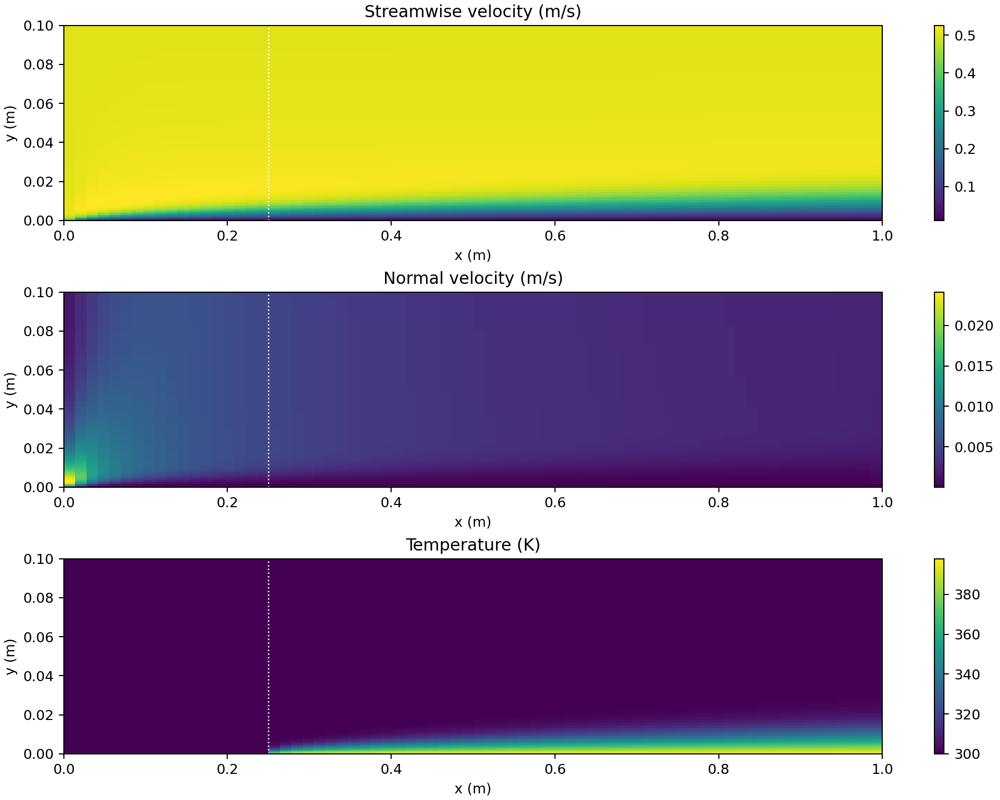
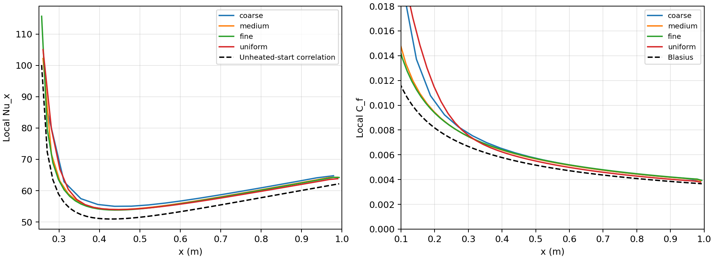
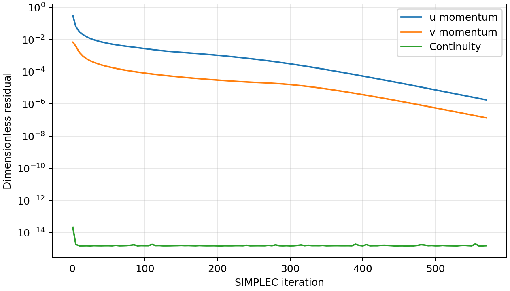
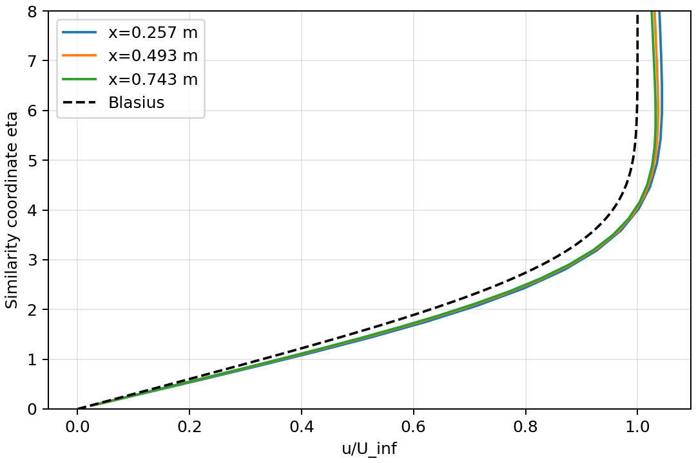
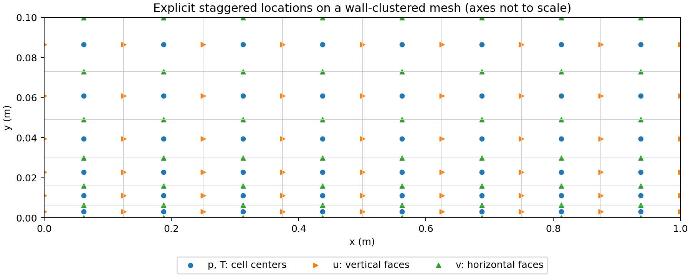

# Laminar Flat-Plate Flow and Heat Transfer: A Solver Revisited

Status: executable steady SIMPLEC momentum/pressure coupling and energy
transport, with operator verification and physical benchmark comparisons.
The results are a later reconstruction, not the results of the original
unsuccessful course submission.

I originally attempted this pressure-velocity problem as my second graduate
CFD term project, but the submitted solver did not converge. This directory is
a later reconstruction based on that work. It documents the defects found in
the original formulation and keeps each correction tied to a reproducible
test.

## Reconstructed problem

The submitted report describes a 1 m by 0.1 m flat-plate domain, inlet velocity
0.5 m/s, inlet temperature 300 K, and a wall heated to 400 K downstream of a
specified location. The reference settings use rho=1.205 kg/m^3, Pr=0.713,
cp=1005 J/(kg K), and k=0.0257 W/(m K).

The shared reference notebook by Chang Min Lee specifies a heating start of
0.25 m. This value is adopted instead of the inconsistent values in the
original working files. Viscosity is computed as mu=Pr*k/cp, also following
that notebook's parameter convention. `Physics` in `flat_plate.py` records
these defaults. The original assignment sheet has not been independently
recovered, so this is an explicitly reconstructed benchmark.

| Boundary | Velocity / pressure | Temperature |
|---|---|---|
| Inlet | u=0.5 m/s, v=0; no normal velocity correction | 300 K |
| Bottom plate | u=v=0; no normal velocity correction | 300 K for x<0.25 m; 400 K thereafter |
| Outlet | gauge p=0; zero normal diffusive velocity flux; v zero x gradient | zero x gradient |
| Top | u=0.5 m/s; gauge p=0; zero normal diffusive v flux | zero y gradient |

The normal velocities at outlet and top are solved and pressure-corrected;
they are not overwritten after correction. The top permits boundary-layer
entrainment. The tests check for outflow on these thermal boundaries; reverse
flow would require an explicit temperature inflow condition. Pressure-zero
open boundaries are a documented reconstruction choice, not a reproduction
of the notebook's pressure-row penalty treatment. Gravity, buoyancy, viscous
dissipation and temperature-dependent properties are omitted.

## Coupled numerical method

`flat_plate.py` assembles conservative first-order upwind convection and
two-point diffusion on staggered control volumes, including the half volumes
at open normal-velocity boundaries. Momentum prediction uses sparse direct
linear solves and velocity under-relaxation of 0.5. SIMPLEC face responses use
the relaxed momentum diagonal minus the sum of retained neighbor coefficients.
All denominators must be positive; no arbitrary small-denominator clipping is
used. Pressure is updated with relaxation 0.7.

The pressure-correction equation includes outlet and top coefficients with
zero boundary correction. Continuity is checked in every cell. Convergence
also requires residuals of both **unrelaxed** momentum equations, reassembled
using the corrected velocity and pressure fields, below 2e-6 after division by
the local diagonal and free-stream speed. Energy is solved after flow
convergence because constant-property forced convection is one-way coupled.
Energy balance uses exactly the boundary fluxes of the discrete energy equation.

The wall heat flux is k*(T_wall-T_first)/y_first. Local Nu_x uses distance from
the plate leading edge, not distance from the heating start. The wall shear is
mu*u_first/y_first. All meshes place the heating transition on a scalar face.

## Executed results and limits

All five flow cases passed nonlinear momentum convergence, every-cell
continuity, global mass balance, energy balance and temperature-bound checks.
The benchmark errors below are mean absolute relative differences over
0.35<=x<=0.85 m, evaluated at each grid's cell centers.

| Case | Grid | Height (m) | SIMPLEC iterations | Nu difference | Cf difference | Net wall heat (W/m span) |
|---|---|---:|---:|---:|---:|---:|
| Coarse, stretched | 24 x 16 | 0.10 | 135 | 6.86% | 10.37% | 219.135 |
| Medium, stretched | 48 x 32 | 0.10 | 320 | 5.15% | 9.44% | 217.017 |
| Fine, stretched | 72 x 48 | 0.10 | 570 | 4.92% | 10.14% | 217.009 |
| Uniform | 48 x 32 | 0.10 | 190 | 4.71% | 5.95% | 219.494 |
| Taller, stretched | 48 x 48 | 0.15 | 360 | 5.12% | 9.78% | 217.142 |

For the fine case, the maximum dimensionless momentum residuals are
1.81e-6 (u) and 1.40e-7 (v). The global mass imbalance is below 9e-17 of
inlet flow and the energy imbalance is 1.13e-13 of net wall heating.
These small conservation errors characterize the discrete solution, not
its accuracy relative to the physical continuum problem.

The remaining approximately 10% skin-friction difference is material and does
not decrease monotonically with the tested stretched grids. Uniform spacing
even gives smaller benchmark differences at the medium cell count. Thus wall
clustering works, but this study does not claim that it necessarily improves
accuracy or that the solution is grid independent. First-order convection,
the finite-domain boundary treatment and leading-edge resolution remain
possible contributors; their individual errors have not been isolated.

Increasing height from 0.10 to 0.15 m at nx=48 changes net wall heat by about
0.058%. The transverse count increases from 32 to 48 to keep similar nominal
spacing; the stretched cell locations still differ, so this is a combined
domain/mesh sensitivity check, not a proof of domain independence.

Detailed data: [flow verification](results/flow_verification.csv),
[wall profiles](results/wall_profiles.csv), [parameters](results/physics.json).
The compressed `*_fields.npz` files include face coordinates, u, v, p, T and
iteration histories for further inspection.









## Findings from the original implementation

- A staggered v velocity must lie on the scalar cell's horizontal face. The
  original construction averages adjacent scalar centers instead. On a
  nonuniform mesh this is generally a different coordinate.
- The pressure-correction iteration reads neighboring pressure estimates
  (p_star) instead of neighboring pressure corrections (p_prime). Its neighbor
  offsets are also one slot in a combined array where scalar nodes are two
  slots apart. Small iterate changes therefore do not establish that the
  pressure-correction equation has been solved.
- West and south coefficient removal uses the opposite coordinate index in
  the pressure-correction boundary block.
- Several physical variables share square combined arrays. This obscures
  their different locations and assumes matching streamwise and transverse
  grid counts in parts of the implementation.

These are code-level findings, not a quantified attribution of every observed
failure. Wall clustering alone is not evidence of a defective grid.

## Verified building blocks

`staggered_grid.py` stores explicit face coordinates, cell centers, widths and
volumes. Arrays have independent shapes: p/T=(ny,nx), u=(ny,nx+1),
v=(ny+1,nx). Face coordinates are not rounded or reconstructed from centers.

`pressure_projection.py` solves an integrated pressure Poisson problem and
applies the matching face pressure gradients. This is a closed-boundary
manufactured test, not the final external-flow pressure boundary treatment and
not an implementation of SIMPLEC or SIMPLER. It rejects incompatible prescribed
boundary fluxes and fixes the pressure gauge by eliminating one unknown.

`run_verification.py` checks uniform and stretched rectangular grids, including
stretching in both axes. It checks exact affine-field divergence, recovery of
a known pressure perturbation superposed on a divergence-free field, preservation
of boundary fluxes, and continuity in every cell including the pressure gauge
cell. This demonstrates discrete operator compatibility; it is not a continuum
accuracy or full momentum-convergence study.

## Run

Requires Python 3.10+, NumPy, SciPy and Matplotlib. Tested with Python 3.11,
NumPy 2.2.6, SciPy 1.16.3 and Matplotlib 3.10.3.

```sh
python -m pip install -r requirements.txt
python run_all.py
```

Outputs are written next to the script in `results/`.
The five-case run took about one minute on the development machine; runtime
depends on hardware. `python run_verification.py` runs only the inexpensive
geometry and pressure-projection tests. `run_all.py` additionally tests the
transport assembly using an affine harmonic field on a nonuniform grid.

The four executed cases reduced maximum divergence from approximately
25 s^-1 to at most 3.3e-10 s^-1. The maximum recovered-pressure error was
2.4e-12 Pa. Detailed values are in
[operator_verification.csv](results/operator_verification.csv).



## Reference provenance

Chang Min Lee's locally shared `solution-for-share.ipynb` was read to recover
parameters and the unheated-start Nusselt comparison formula. The notebook is
not redistributed. The revised solver was written separately with sparse
assembly and explicit nonuniform staggered geometry during an AI-assisted
portfolio review. Its new results are presented as post-course reconstruction
results, not as results achieved in the original submission.

The Blasius boundary-value ODE is solved independently with SciPy and checked
against f''(0)=0.3320573362. NASA's
[laminar flat-plate validation case](https://www.grc.nasa.gov/www/wind/valid/fplam/fplam.html)
provides the physical benchmark context. The thermal comparison is the
approximate formula used in the shared notebook:

$$Nu_x=0.332\,Re_x^{1/2}Pr^{1/3}
\left[1-(\xi/x)^{3/4}\right]^{-1/3},\qquad x>\xi.$$

It is a boundary-layer approximation, not an exact solution of this finite
domain with streamwise diffusion. The upstream wall is prescribed at inlet
temperature rather than insulated; small upstream conductive heat leakage is
included in the numerical net wall heat. Comparisons use 0.35<=x<=0.85 m to
exclude the heating discontinuity and immediate outlet region.
